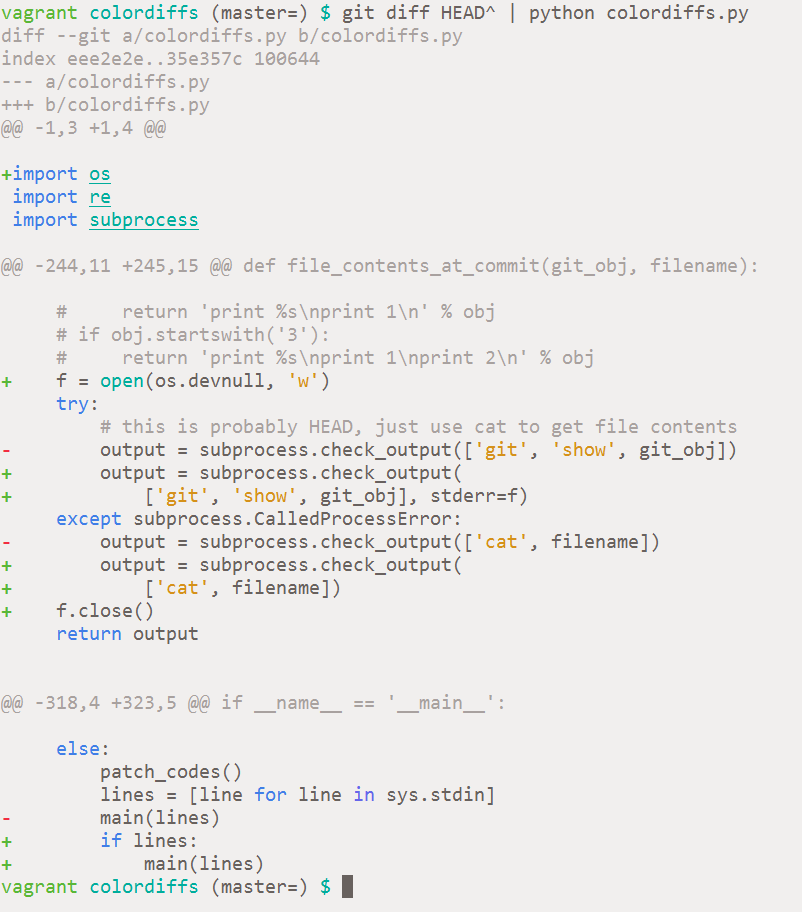

==========
Colordiffs
==========

Colors for your git diffs

Colordiffs is under development, things are bound to be broken.
If you would like to help out, start an issue or submit a pull request :)

Installation
============

::

    pip install colordiffs

How to run
==========

::

    git diff HEAD^ | colordiffs | less -r

explanation

1. ``git diff HEAD^`` gets a diff between the current and the previous commit
2. ``colordiffs`` reads a diff from stdin
3. ``less -r`` takes the output of colordiffs and uses ``less`` to page it, the ``-r`` is required to interpret the terminal escape codes

Requirements
============

::

    Python 2.x, 3.x
    Pygments

TODO
====

Support more kinds of `git diff` output. Right not it supports the most common `---` `+++` diffs, but if the diff is for a new file or deletion of file it breaks.
